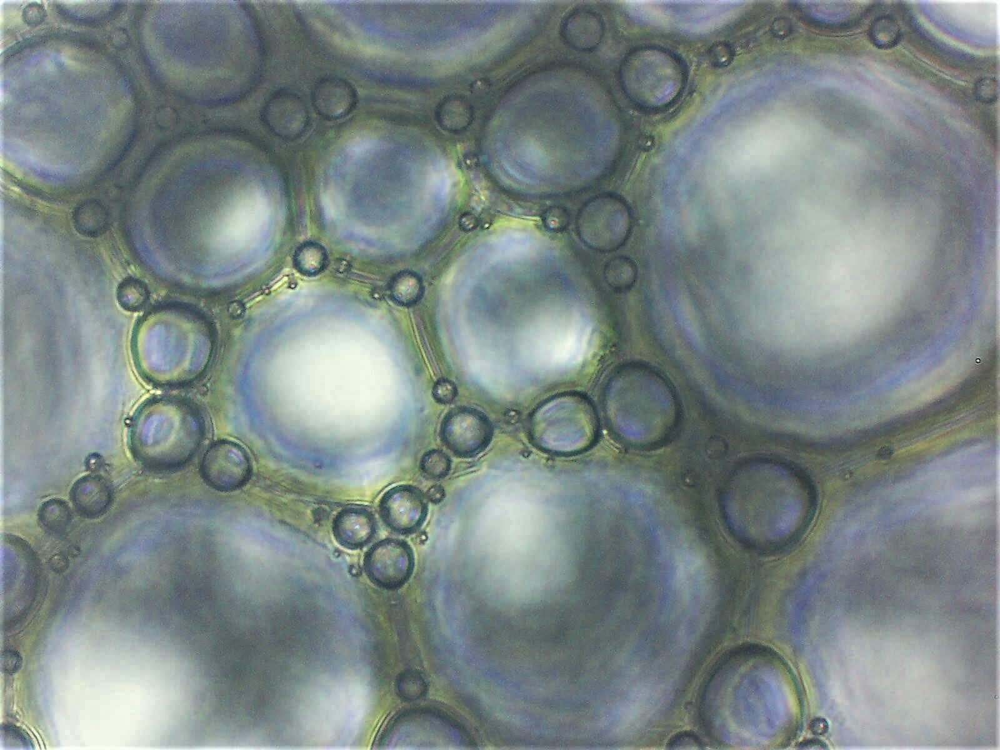
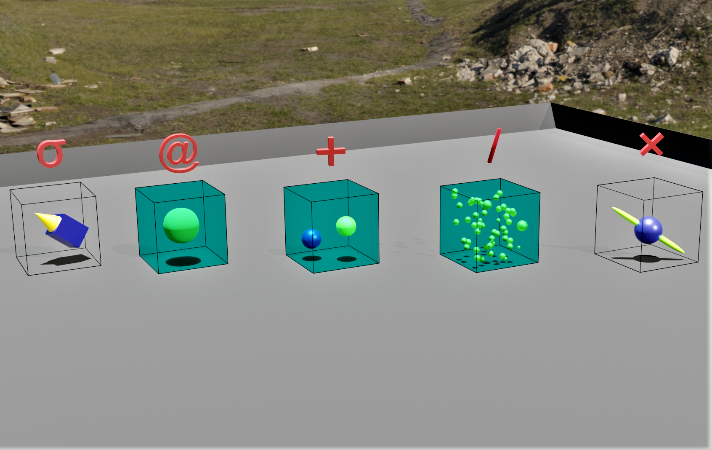

# disperse

Procedural food structure generator based on the Dispersed System Formalism



This is a simple application for a highly specific use-case: creating random dispersed systems containing multiple phases.

It should work on desktop and mobile, although there is a slightly annoying visual bug when scrolling in the about page on mobile (transparent coloured bar appears for a moment).

---

## Dispersed System Formalism (DSF)

DSF is a semi-formal language developed for describing multi-phase systems.

Dispersed systems include common everyday things like bread (solid foam: `G/S`) and milk (emulsion: `O/W`).

A more complex example is ice-cream, which is a foam, emulsion and a suspension (in DSF: `(G + O + S)/W`).

Currently, this app allows you to generate binary and ternary systems. So no ice-cream for you (*just yet*).

## Contents

- [syntax](#syntax)
- [purpose](#purpose)
- [applications](#applications)
- [use-case](#use-case)
- [limitations](#limitations)
- [references](#references)
- [to-do](#to-do)

---

## Syntax

The formalism consists of objects (the phases):

> gas (G), oil (O), solid (S) and water (W)

and binary predicates (topological relations):

> dispersed in (/), included within (@), superposed on (σ), bicontinuous with (×) and in addition to (+)

The `+` operator can be understood as a ternary operator - in relational algebra this would be the case `R(xyz)` - as it always relates some `x` and `y` to a `z`.
For example, `(x + y)/z` signifies that the first two phases in the formula are not topologically related
to each other but bear a topological relation to a common `z`, in this case by their both being dispersed in
that phase.

Parentheses are used to disambiguate the resultant formula, such that `(G+O)/W` is not equivalent to `G+(O/W)`.
The web app will simply return `G+O/W` and leave it to the user to define the formula further. Implementing
parentheses in the code would likely be awkward. It would be preferable to use pre- or post-fix notation to
make this implementation more trivial (at least for my abilities) but this would be at the cost of human readability.

When the same object appears in direct relation to itself, such as in `W/W/G`, the formula can generally be reduced (`w/G`) unless
it is understood that each symbolises a different kind of that object. The resolution of such cases is particular to the context
of discovery. For example, for `W` and `S` we could have:

 ```math
 W_1 = salt solution
 W_2 = syrup droplets
 W_n = ...
 S_1 = solid body
 S_2 = solid fragments
 S_n = ...
 ```



## Purpose

DSF is an expansion of the common practice in physico-chemical sciences of describing an emulsion of oil in water as:

```math
O/W
```

DSF expands the range of phases in the domain of objects such that a suspension of gas bubbles in a solid can be written:

```math
G/S
```

It also expands the set of relations beyond `dispersion (/)` to allow for more complex topological descriptions. For example, if each gas bubble
was itself contained within a shell of some aqueous material we could write:

```math
(G@W)/S
```

This app provides a convenient means to generate valid DSF formulas for [binary](https://edibotopic.github.io/disperse/) or [ternary](https://edibotopic.github.io/tern/) combinations of phases.

The binary generator includes an <kbd>emojify</kbd> button that generates an example of the generated formula. **Note:** only a small subset of the binary formula can currently be converted into emojis. *This is a work-in-progress*.

The ternary generator includes a <kbd>disambiguate</kbd> that converts from infix notation (more ambiguous) to postfix notation (less ambiguous). **Note:** the algorithm for disambiguating the formulas is very simple - it merely pushes the operators to the left side of a given formula. The resultant formula is clear and unambiguous (if one can read prefix notation); however, a side effect is that the semantics of the infix and prefix formulas can deviate. This is not a problem *per se*, if one wants to simply generate an unambiguous formula.

## Applications

There are two distinct uses of DSF:

### Analytical

The formalism is a simple and efficient method of describing systems that are difficult to describe in plain language. In this sense DSF is analogous to notation commonly used by scientists for chemical reactions.

### Generative

The formalism is a rare example of a method for procedurally generating food structures. In this sense there is no obvious analogy to DSF in the sciences.

This simple web app focuses on a limited implementation of DSF as a **generative** tool.
It is a starting point for generating *multi-phase structures* (food or otherwise), broadly defined as:

> A system consisting of at least two distinct phases that are related topologically in space

## Use-case

Imagine you are tasked with developing a new food product. You generate a formula as follows (in default infix notation):

`G/O+W`

or in prefix notation:

`/+GOW`

This structure will require the following protocol to manufacture:

1. Prepare a solution **W** of some solutes (e.g., sugar, protein)
2. Whip air **G** into solution (e.g., using a high-shear mixer)
3. Emulsify oil **O** into solution (e.g., again using a mixer)

The inclusion of each phase presents various opportunities:

- Solvents can dissolve different kinds of molecules (vitamins, flavours, aromas)
- Textures can develop through phase dispersion (mouthfeel associated with emulsions)
- Calories can be reduced by creating a volume fraction comprised of air (see ice-cream)

## Limitations

This app is not a full implementation of the ideas presented in the DSF literature. Some authors have suggested how quantitative data can be included in the formulas. However, my view is that the primary novelty of DSF is as a *qualitative tool* that can generate *possible structures*. This implementation (and any future versions) will focus on these aspects of DSF.

DSF allows for dimensional information to be included in formulas, such that the the *n*-dimensionality of each phase in 3-dimensional space can be signified. This is trivial to implement but I have not got around to it.

## References

to be completed...

## To-do

- [x] Publish initial version of app
- [x] Compress media files
- [x] Give example food formulas
- [x] Add illustrated examples of predicates
- [x] Improve mobile UX and fix bugs
- [x] Add infix-prefix converter (disambiguation)
- [ ] Add dimensions
- [ ] Complete the emojififier
- [ ] Add some kind of recipe suggester
- [ ] Make design of *About* page less awful (or remove)
- [ ] Add quaternary generator (if only for ice cream)
- [ ] Complete description of DSF in readme
- [ ] Give example non-food formulas
- [ ] Add academic references for DSF (Hervé's papers)
- [ ] Apologise to all programmers for my bad habits

## Releases

### 0.1.0

- Emojifier added
- Disambiguator added
- UX improvements (menus)
- Fixed bugs
- Initial refactoring

### 0.0.1

- Initial release
- Binary formula generator
- Ternary formula generator

## Contributions

I don't expect this app to have a wide user base. If you have any suggestions or questions you can open an issue.
Hopefully by then I will have sufficient competence using GitHub to respond appropriately.
